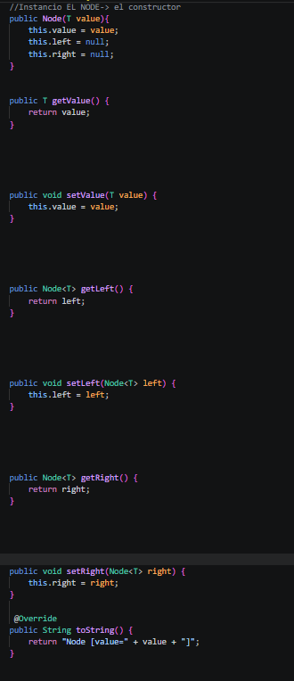
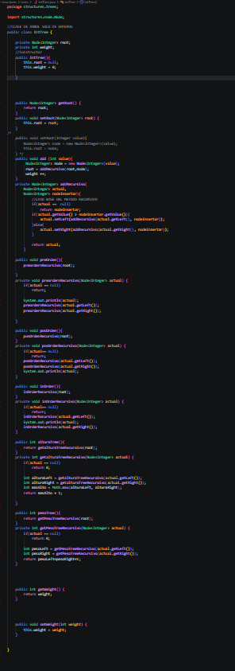
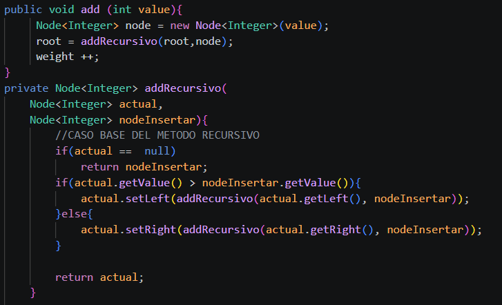
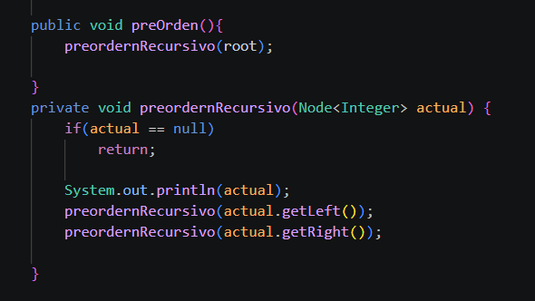
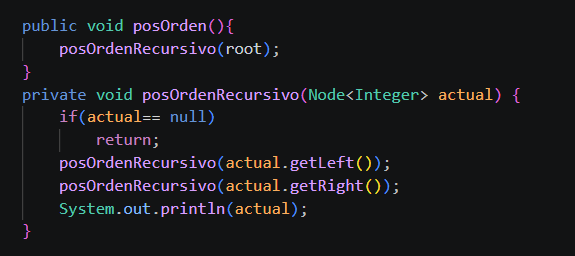
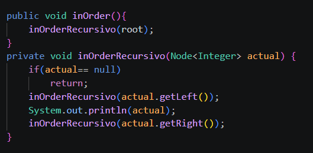
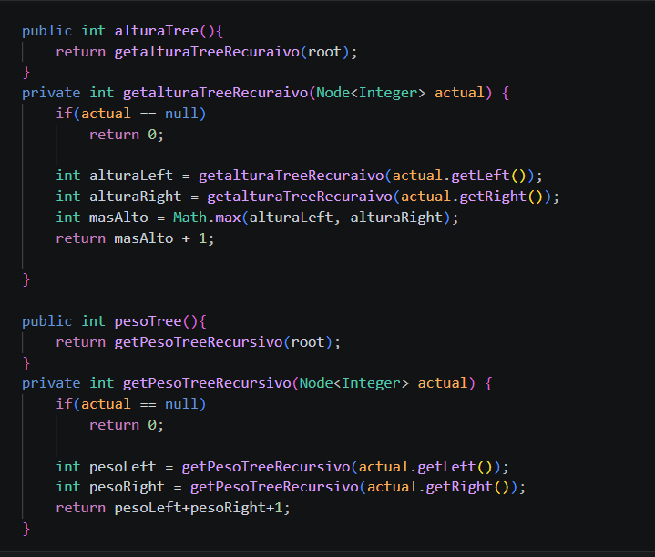

# Práctica: Ejercicios de logica con estructuras lineales: pilas y colas

## Datos del Grupo
- **Nombres:**  Cristopher Carangui.
- **Curso:** Estructura de Datos
- **Fecha:** 22/06/2026

---

## 1. Estrucutras NoLineales

**Fecha:** 17/06/2026
## Creacion de nodos
Se crea una clase de nods para obtener variables genericas para nuestros ejercicios. 

## Intree
Se crea una clase inTree que se fue programando en conjunto con el profe para usar diferentes metodos como fue usar recursividad, preOrder, posOrder, inOrder, peso y altura del arbol.

## Recursivo 
Se desarrolla el metodo para obtener la raiz del arbol y condicionales para sacar nodos padres que se va a dar si es mayor o menor del root, a continuacion obtener los nodos hijos.

## Ordenamiento de arboles
Se puede ordenar de tres diferentes maneras nuestros arboles:
## preOrder
El cual se visita primero la raíz, luego el subárbol izquierdo y finalmente el subárbol derecho.

## posOrder
En este caso se visita primero el subárbol izquierdo, después el derecho y al final la raíz.

## inOrder
 Se recorre primero el subárbol izquierdo, luego la raíz y al final el subárbol derecho.
 
## Altura y Peso
Estos metods nos ayudan a ver que altura tiene nuestro arbol y el peso de este.

**Fecha:** 20/06/2026
## BinaryTree
