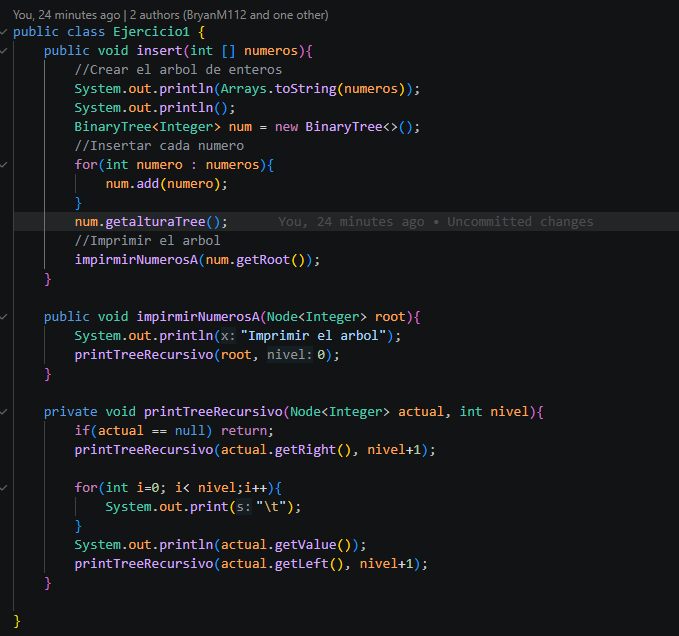
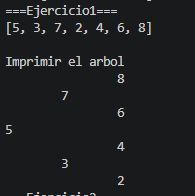
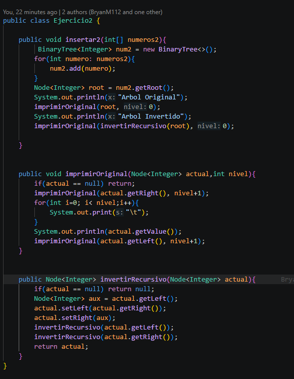
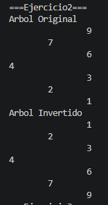
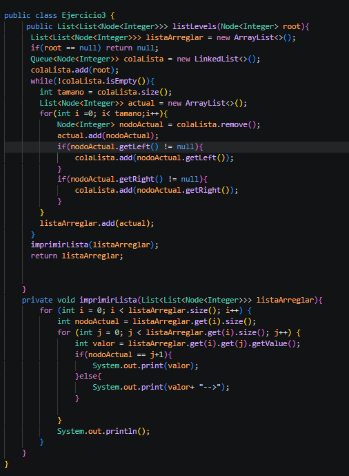
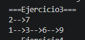
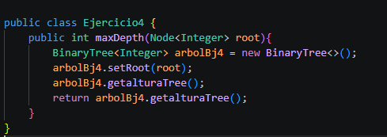
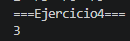
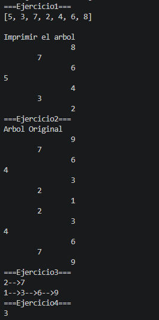

# Informe

# Práctica: Ejercicios de logica con estructuras lineales: arboles

- **Nombre:**  Cristopher Carangui
- **Curso:** Estructura de Datos
- **Fecha:** 23/06/2026

---

## 1. Descripcion
Esta practica consta de 4 ejercicios donde cada uno subia la complejidad y nos ayudaba mas en el tema aprendidio en clases sobre arboles, descubriendo diferentes formas de imprimir los arboles o utilizar metodos hechos en clases como BinaryTree, colas o pilas.

## Ejercicio1
## Descripción:
El ejercicio 1 fue de una lista de entero el cual antes hecho en una hoja se reconoce la raiz o root que empieza en 5 , y se va con condiciones haciendo los hijos en este caso si el numero es menor o mayor al root. El metodo de imprimir utilizamos para organizar el arbol como se habia mencionado de mayor o menor haz obtener todo el arbol con el root y nivel de cada uno.
## Ejercicio2
## Descripción:
El ejercicio 2 es nos pide invertir un arbol como en el anterior ejercicio se tuiliza una lista de enteros como primero paso se ordena el arbol para obtener como va el arbol y con eso se utiliza un metodo inverir el cual la rama que esta ala izquiera pasa a ser de la derecha eso se obtiene setiando los valores de la izquiera ala derecha
## Ejercicio3
## Descripción:
El ejercicio 3 fue un ejercicio complicado ya que se pide una liza enlazada con nodos con cada nivel el cual para mi empiezo el metodo como se pide para lo cual implemento una lista donde va estar mi lista de numeros , a lo siguente utilizo colas para utilizar el metodo de fifo y con un bucle while para añadir la raiz y con otro bucle for ir por el tamaño de la cola.El bulce for me ayuda recorrer toda miu lista y con un nodoactual poder agregar cada una a la izquiera o derecha. Con un metodo imprimir voy imprimiendo la lista de como recorrio cada nodo y nivel de el arbol.
## Ejercicio4
## Descripción:
El ejercicio 4 fue un ejercicio donde se pudo reutilizar codigo hecho en clases ya que se utiliza un binarytree que tiene el metodo de profundidad de un arbol
## Tabla de evidencias requeridas
| Ejercicio| Evidencia de Codigo | Evidencia de consola | Observacion|                                                                                                                         |
| ----------------: | -------------------------: | ---------------------: | -------------------- | ------------------------------------------------------------------------------------------------------------------------------------ |
|            Ejercicio1:Insertar en BST|                     |              | Se obtiene el resultado requerido                                                          |
|            Ejercicio2: Invertir arbol binario|                    |                 |Se obtiene el arbol original y el arbol invertido                                       |
|           Ejercicio3: Listar niveles|                  |                |Se imprime exactamente como se pide |
Ejercicio4: Profundidad maxima |                     |                               |  Se reconoce la profundiad del arbol|

## Salida en consola

